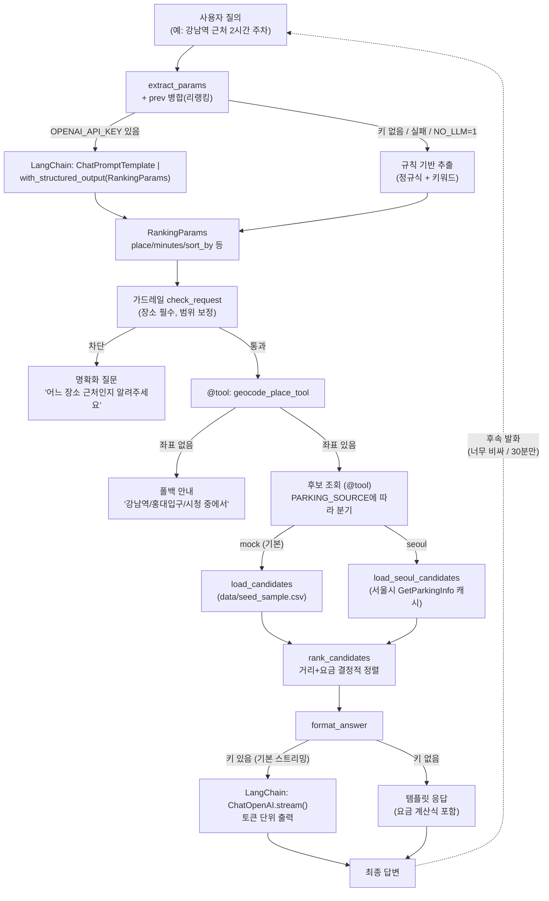

# parking-agent

운전자용 주차장 추천/안내 에이전트. 최소 파이프라인 검증 완료 후 실데이터 전환 중이다.

> 범위: 백엔드 에이전트 우선

## 목표 (이번 세션)

기본 시나리오 검증:

1. 텍스트 대화로 "어떤 장소 근처 주차장 알려줘" 입력
2. LLM이 랭킹 파라미터(`RankingParams`)를 추출/구조화
3. 주차장 리스트(Mock seed 또는 서울시 실데이터)에 파라미터로 랭킹
   (미지정 값은 내재 선호 `recommended`로)
4. 불만족/추가 정보 입력 시 리랭킹

## 최소 파이프라인 (LangChain, LangGraph 없음)



```
사용자 질의 ("강남역 근처 2시간 주차")
 → extract_params (LLM structured output, 키 없거나 NO_LLM이면 규칙 기반 폴백)
 → check_request 가드레일 (장소 필수, 시간·반경 범위 보정)
 → @tool 호출: geocode_place_tool → search_parking_tool (seed CSV 또는 서울시 캐시)
 → rank_candidates (거리+요금 결정적 정렬)
 → format_answer (LLM 설명, 키 없으면 템플릿 폴백)
 → 후속 발화 ("너무 비싸") + prev 병합 → 리랭킹
```

- LangGraph (`StateGraph`, `ToolNode`, `MessagesState`)는 사용하지 않는다.
- 실모델 연결됨 (`MODEL_NAME=gpt-5.6-luna`, 기본 스트리밍). 서울시 실데이터 어댑터 구현됨
  (122건 캐시, 지오코딩 대기). Mock이 기본값이라 키 없이도 전체 검증 통과.
- 데이터 흐름 상세: [docs/SEOUL_API.md](./docs/SEOUL_API.md)

## 빠른 시작

```bash
pip install -r requirements.txt

# 환경변수 (.env)
copy .env.example .env
# OPENAI_API_KEY / MODEL_NAME (실모델용)
# SEOUL_OPENAPI_KEY (실데이터용), PARKING_SOURCE=seoul 로 전환

# 대화형 데모 (리랭킹 포함, 기본 스트리밍)
python scripts/demo_cli.py
python scripts/demo_cli.py "강남역 근처 2시간 주차 알려줘" --once
python scripts/demo_cli.py "시청역 근처 1시간" --once --no-stream

# 실데이터 캐시 (서울시 122건, 키 필요)
python scripts/cache_seoul.py

# 자동 검증 (PARKING_AGENT_NO_LLM=1 고정, 키 불필요)
python scripts/verify_pipeline.py

# 단위 테스트
python -m pytest tests/ -q
```

## 검증 기준

- [x] `추출 → 조회 → 랭킹 → 응답 → 리랭킹` 순서 동작
- [x] `place/minutes/sort_by` 추출 정확 (S1~S4)
- [x] 장소 미지정/지오코딩 실패 시 폴백 안내 (S5/S6, 스택 노출 없음)
- [x] 최종 답변에 요금 근거(계산식) 포함
- [x] `pytest 8/8` + `verify 12/12` 통과 (rule 기반)

자세한 단계별 계획은 [PLAN.md](./PLAN.md), 필요한 키 정리는 [docs/KEYS_NEEDED.md](./docs/KEYS_NEEDED.md) 참조.
