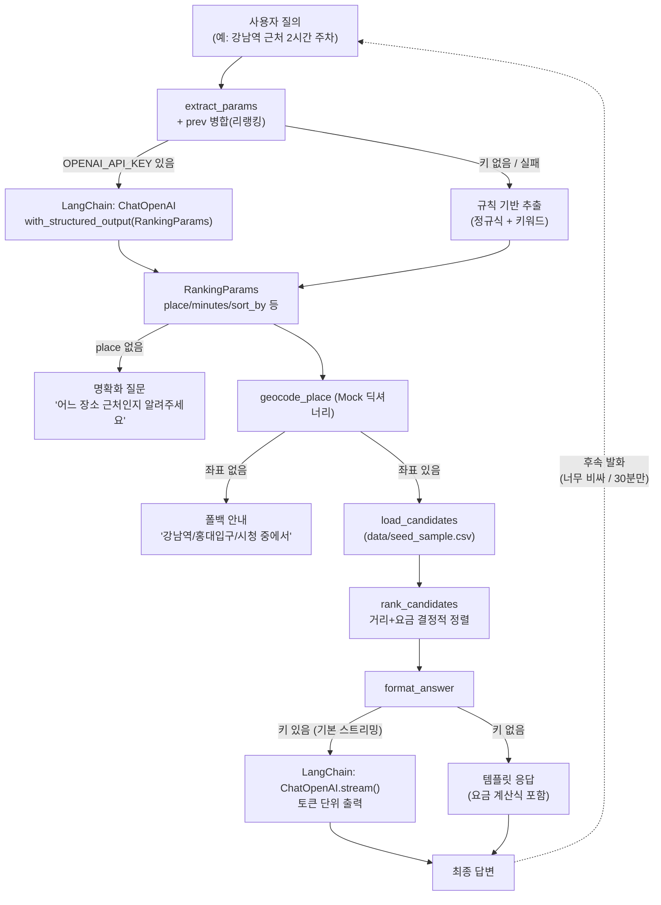

# parking-agent

운전자용 주차장 추천/안내 에이전트. 현재 단계 목표는 **기능 고도화가 아닌 최소 파이프라인 검증**이다.

> 범위: 백엔드 에이전트 우선

## 목표 (이번 세션)

기본 시나리오 검증:

1. 텍스트 대화로 "어떤 장소 근처 주차장 알려줘" 입력
2. LLM이 랭킹 파라미터(`RankingParams`)를 추출/구조화
3. 주차장 리스트(Mock, 추후 실API)에 파라미터로 랭킹 (미지정 값은 LLM 내재 선호 `recommended`로)
4. 불만족/추가 정보 입력 시 리랭킹

## 최소 파이프라인 (LangChain, LangGraph 없음)



```
사용자 질의 ("강남역 근처 2시간 주차")
 → extract_params (LLM structured output, 키 없으면 규칙 기반 폴백)
 → geocode_place_mock → load_candidates (seed CSV)
 → rank_candidates (거리+요금 결정적 정렬)
 → format_answer (LLM 설명, 키 없으면 템플릿 폴백)
 → 후속 발화 ("너무 비싸") + prev 병합 → 리랭킹
```

- LangGraph (`StateGraph`, `ToolNode`, `MessagesState`)는 이번 단계에서 도입하지 않는다.
- 외부 API (`data.go.kr`, 카카오/네이버 지도)는 연동하지 않고, `Mock`으로 대체한다.
- 키가 없어도 `verify_pipeline.py`는 100% 통과하도록 설계했다.

## 빠른 시작

```bash
pip install -r requirements.txt

# LLM 품질 확인용 (선택, 없어도 동작)
copy .env.example .env
# OPENAI_API_KEY / OPENAI_BASE_URL / MODEL_NAME 기입

# 대화형 데모 (리랭킹 포함)
python scripts/demo_cli.py
python scripts/demo_cli.py "강남역 근처 2시간 주차 알려줘" --once

# 자동 검증 (키 불필요)
python scripts/verify_pipeline.py

# 단위 테스트
python -m pytest tests/ -q
```

## 검증 기준

- [x] `추출 → 조회 → 랭킹 → 응답 → 리랭킹` 순서 동작
- [x] `place/minutes/sort_by` 추출 정확 (S1~S4)
- [x] 장소 미지정/지오코딩 실패 시 폴백 안내 (S5/S6, 스택 노출 없음)
- [x] 최종 답변에 요금 근거(계산식) 포함
- [x] `pytest 8/8` + `verify 12/12` 통과 (rule 기반)

자세한 단계별 계획은 [PLAN.md](./PLAN.md), 필요한 키 정리는 [docs/KEYS_NEEDED.md](./docs/KEYS_NEEDED.md) 참조.
